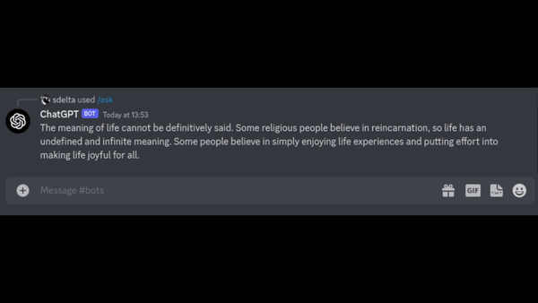

<div align="center">
  <h1>
    🤖
    <br />
    ChatGPT Discord Bot
    <br />
  </h1>
  <sup>
    A Discord Bot that leverages OpenAI API to return ChatGPT responses.
    <br />
  </sup>
  <br />
  <br />
</div>

<div align="center">

</div>

## 🧰 Local Development

To get started locally running the project:

```bash
# Clone the repository
git clone https://github.com/zpuckeridge/chatgpt-discord-bot

# Rename .env.example to .env
mv .env.example .env

# Add your OpenAI API Key to .env
OPENAI_API=YOUR_API_KEY

# Rename config.example.json to config.json and add your relevant details
mv config.example.json config.json

# Navigate to the cloned files
cd chatgpt-discord-bot/

# Install packages
npm install

# Run the server
npm run dev
```

## 🚀 Deployment

To get the project running in Docker:

```bash
# Build the image
docker build -t chatgpt-discord-bot .

# Run the container with image
docker run -d chatgpt-discord-bot
```

## 🚩 Features

- Basic ChatGPT functionality

## 👀 Coming soon

These features are due to be implemented soon:

- Threads to allow continuous conversation
- More robust error handling
- More robust logging
- Better slash command experience
